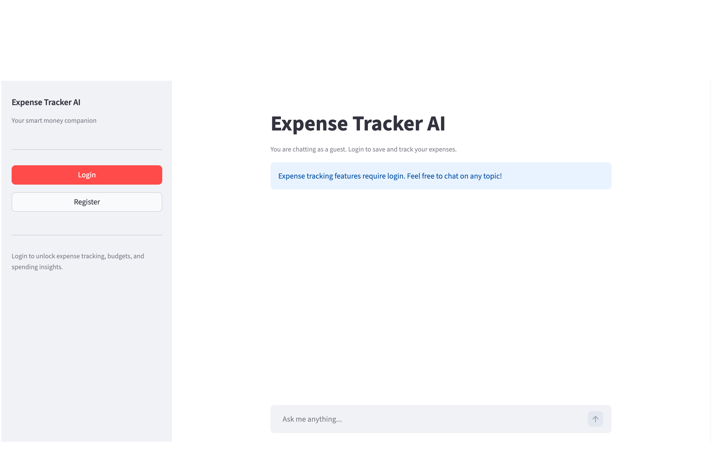
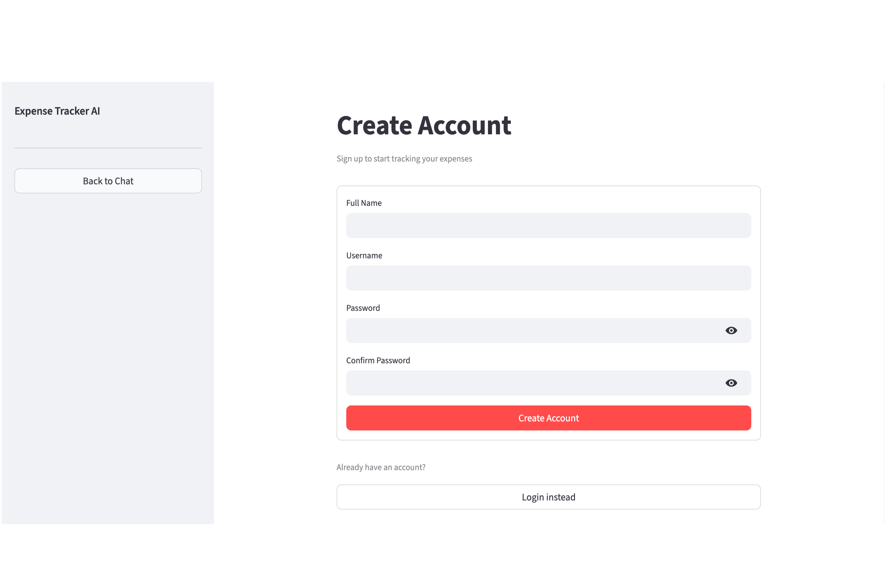
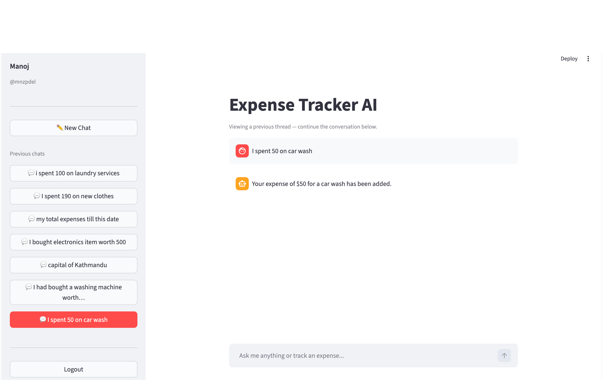

#  LangGraph MCP Finance Agent

An AI-powered personal finance assistant that lets you track expenses, manage budgets, and get spending insights — all through natural language conversation.

Built with **LangGraph**, **FastMCP**, **Supabase**, and **Streamlit**, it features a multi-user authentication system, persistent chat history, and a clean agent loop that intelligently decides when to call tools vs. when to just chat.

---

##  Screenshots

### Guest View


### Create Account


### Main Chat Interface


### Agent Graph


---

##  Features

- **Natural Language Expense Tracking** — Add, update, and delete expenses by just describing them ("I spent $45 on groceries")
- **Smart Update Detection** — The agent recognizes corrections ("actually it was $50") and updates existing records instead of creating duplicates
- **Budget Management** — Set monthly budgets and get real-time status with over-budget warnings
- **Spending Trends** — Visual ASCII bar chart of your last 6 months of spending
- **Category Summaries** — Monthly and all-time breakdowns by category
- **Recurring Expenses** — Register fixed monthly costs (rent, subscriptions, etc.)
- **Persistent Chat History** — Conversations are saved per user and accessible from the sidebar
- **Multi-User Auth** — Secure registration and login; credentials are injected at tool call time so the LLM never sees them
- **Guest Mode** — Chat freely without an account; expense tools prompt you to log in

---

##  Project Structure

```
LangGraph-MCP-Finance-Agent/
├── Expense_tracker_mcp.py   # FastMCP server — all tools + Supabase logic
├── agent_graph.py           # LangGraph agent loop + MCP client + auth helpers
├── app.py                   # Streamlit frontend
├── requirements.txt         # Python dependencies
└── .env                     # Environment variables (not committed)
```

---

##  Getting Started

### Prerequisites

- Python 3.10+
- A [Supabase](https://supabase.com) project (free tier works)
- A [Groq](https://console.groq.com) API key
- A [FastMCP Cloud](https://fastmcp.cloud) account (for hosting the MCP server)

### 1. Clone the Repository

```bash
git clone https://github.com/manozpdel/LangGraph-MCP-Finance-Agent.git
cd LangGraph-MCP-Finance-Agent
```

### 2. Install Dependencies

```bash
pip install -r requirements.txt
```

### 3. Host the MCP Server on FastMCP Cloud

The MCP server (`Expense_tracker_mcp.py`) is hosted on [FastMCP Cloud](https://fastmcp.cloud) via GitHub integration. The live server for this project is available at:

```
https://unlikely-blue-starfish.fastmcp.app/mcp
```

To deploy your own instance:

1. Go to [fastmcp.cloud](https://fastmcp.cloud) and sign in with your GitHub account
2. Connect your repository and select `Expense_tracker_mcp.py` as the server file
3. In the FastMCP Cloud dashboard, add the following **environment variables** before deploying:

   | Variable | Description |
   |---|---|
   | `SUPABASE_URL` | Your Supabase project URL (e.g. `https://your-project.supabase.co`) |
   | `SUPABASE_KEY` | Your Supabase anon/service key |

4. Deploy — FastMCP Cloud will give you a hosted MCP URL and an API key

### 4. Set Up Environment Variables (Local)

Create a `.env` file in the root directory for running the Streamlit frontend locally:

```env
# Groq
GROQ_API_KEY=your-groq-api-key

# FastMCP Cloud
FASTMCP_KEY=your-fastmcp-api-key
```

> **Note:** `SUPABASE_URL` and `SUPABASE_KEY` only need to be set on the **FastMCP Cloud server** (step 3), not in your local `.env`. The Streamlit app never talks to Supabase directly — all database access goes through the hosted MCP server.

### 5. Configure the Agent

The agent in `agent_graph.py` is already pointed at the live hosted server. If you deploy your own instance, update the URL accordingly:

```python
SERVERS = {
    "expense": {
        "transport": "streamable_http",
        "url": "https://unlikely-blue-starfish.fastmcp.app/mcp",  # hosted MCP server
        "headers": {
            "Authorization": f"Bearer {mcp_api_key}"
        }
    }
}
```

### 6. Set Up Supabase Tables

The MCP server will attempt to auto-create the required tables on first run. If that fails (due to Supabase RPC permissions), run the following SQL manually in your **Supabase SQL Editor**:

```sql
CREATE TABLE IF NOT EXISTS users (
    id SERIAL PRIMARY KEY,
    name TEXT NOT NULL,
    username TEXT UNIQUE NOT NULL,
    password TEXT NOT NULL
);

CREATE TABLE IF NOT EXISTS expenses (
    id SERIAL PRIMARY KEY,
    user_id INTEGER REFERENCES users(id),
    amount FLOAT NOT NULL,
    category TEXT NOT NULL,
    description TEXT,
    date TEXT NOT NULL,
    timestamp FLOAT NOT NULL
);

CREATE TABLE IF NOT EXISTS budgets (
    id SERIAL PRIMARY KEY,
    user_id INTEGER REFERENCES users(id),
    month INTEGER NOT NULL,
    year INTEGER NOT NULL,
    amount FLOAT NOT NULL,
    UNIQUE(user_id, month, year)
);

CREATE TABLE IF NOT EXISTS recurring_expenses (
    id SERIAL PRIMARY KEY,
    user_id INTEGER REFERENCES users(id),
    amount FLOAT NOT NULL,
    category TEXT NOT NULL,
    description TEXT,
    day_of_month INTEGER NOT NULL
);

CREATE TABLE IF NOT EXISTS chat_history (
    id SERIAL PRIMARY KEY,
    user_id INTEGER REFERENCES users(id),
    role TEXT NOT NULL,
    content TEXT NOT NULL,
    timestamp FLOAT NOT NULL,
    date TEXT NOT NULL
);
```

### 7. Run the Streamlit App

```bash
streamlit run app.py
```

Open [http://localhost:8501](http://localhost:8501) in your browser.

---

##  Available Tools

The MCP server exposes the following tools to the agent:

| Category | Tool | Description |
|---|---|---|
| **Expenses** | `add_expense` | Log a new expense |
| | `get_expenses` | Fetch recent expenses (filterable by category) |
| | `update_expense` | Edit an existing expense by ID |
| | `delete_expense` | Remove an expense by ID |
| | `get_total_by_category` | All-time totals grouped by category |
| | `get_monthly_summary` | Spending breakdown for a specific month |
| **Budgets** | `set_budget` | Set a monthly spending limit |
| | `check_budget_status` | See how much of your budget is used |
| **Trends** | `get_spending_trend` | ASCII bar chart for the last 6 months |
| **Recurring** | `add_recurring_expense` | Register a monthly fixed cost |
| | `get_recurring_expenses` | List all recurring expenses |
| | `delete_recurring_expense` | Remove a recurring expense |
| **Auth** | `register_user` | Create a new account |
| | `login_user` | Authenticate a user |
| | `change_password` | Update account password |
| **History** | `save_chat_exchange` | Persist a conversation turn |
| | `get_chat_history_raw` | Retrieve history as JSON |
| | `clear_chat_history` | Wipe all chat history |

---

##  Dependencies

Key packages used:

- `langgraph` — agent state graph and tool routing
- `langchain-groq` — Groq LLM integration
- `langchain-mcp-adapters` — MCP tool loading for LangChain
- `fastmcp` — MCP server framework
- `streamlit` — frontend UI
- `requests` — Supabase REST API calls
- `python-dotenv` — environment variable management

See `requirements.txt` for the full list.

---

##  Contributing

Pull requests are welcome! For major changes, please open an issue first to discuss what you'd like to change.

